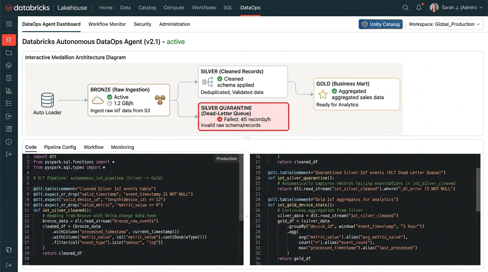
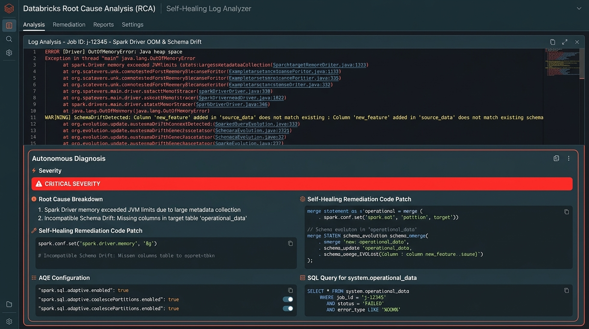
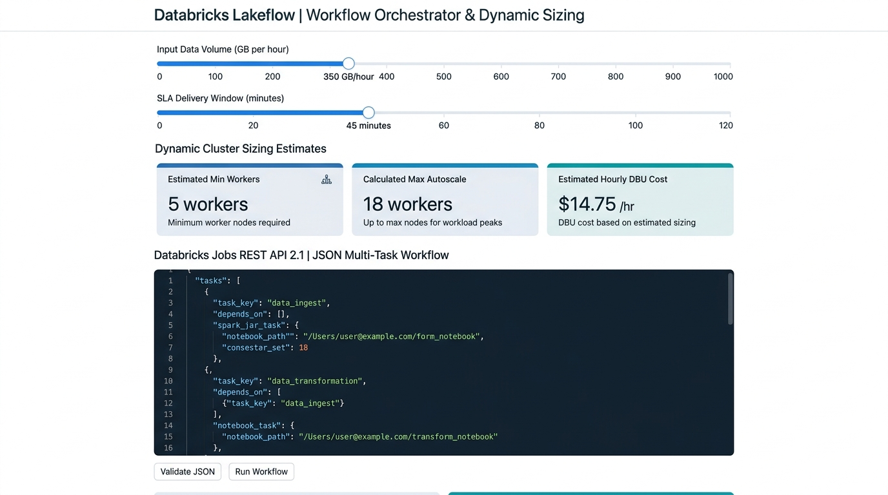

# Databricks DataOps Autonomous Agent

An Autonomous Data Engineering & Operations Agent for the **Databricks Lakehouse Platform**, specializing in **PySpark**, **Lakeflow**, **Delta Live Tables (DLT)**, and **Unity Catalog** governance.

The agent operates as a hybrid Developer, Operations Engineer, and Monitoring Agent to build, execute, monitor, and self-heal production-grade data pipelines end-to-end.

---

## 📸 Application Screenshots

### 1. Lakehouse Medallion Architecture & 4-Section Deliverable
Interactive pipeline designer with real-time Medallion DAG visualizer (Bronze Auto Loader $\rightarrow$ Silver Clean $\rightarrow$ Quarantine $\rightarrow$ Gold Mart) and the standard 4-section Databricks deliverable generator.



---

### 2. Autonomous RCA & Self-Healing Diagnostic Workbench
Real-time stack trace analyzer diagnosing Spark Driver OOM errors, Delta schema drift, Unity Catalog IAM 403 authorization failures, and DLT expectation drop anomalies with instant code patches.



---

### 3. Lakeflow Dynamic Cluster Sizer & Jobs API Orchestrator
Dynamic cluster calculator that calculates minimum and maximum worker nodes and shuffle partition counts based on ingestion volume (GB/hr) and SLA requirements, exporting production Databricks Jobs REST API 2.1 JSON specifications.



---

## ⚡ Core Operational Capabilities & Sub-Agents

1. **Ingestion & Pipeline Creation Agent**:
   - Generates production PySpark and SQL code using Databricks Auto Loader (`cloudFiles`) or Delta Live Tables (`@dlt.table`).
   - Enforces Medallion Architecture (Bronze $\rightarrow$ Silver $\rightarrow$ Gold) under Unity Catalog 3-level namespace (`catalog.schema.table`).
   - Configures incremental streaming, schema evolution (`addNewColumns`), and rescued data column (`_rescued_data`).
   - Implements data quality expectations (`@dlt.expect_or_quarantine`, `@dlt.expect_or_drop`, `@dlt.expect_or_fail`).

2. **Execution & Orchestration Agent**:
   - Generates Databricks Jobs REST API 2.1 multi-task DAG workflow JSON scripts.
   - Dynamically calculates cluster sizing (workers, memory, shuffle partitions) from data volume and SLA parameters.
   - Configures event-driven file arrival triggers, SLA duration alerts, and webhook notifications.

3. **Monitoring & Log Analyzer Agent**:
   - Analyzes driver/executor stack traces, JVM heap dumps, and Databricks system tables (`system.operational_data`, `system.lakeflow.pipeline_events`).
   - Performs Root-Cause Analysis (RCA) on memory bottlenecks, skew joins, network timeouts, and permission mismatches.
   - Audits quarantine dead-letter tables and expectation drop rates.

4. **Self-Healing & Remediation Agent**:
   - Classifies errors into transient (retryable) vs deterministic (code/schema patch required).
   - Generates immediate remediation SQL, PySpark sanitizers, or cluster configuration updates.
   - Drafts automated GitHub Pull Requests with commit messages and descriptions for peer review.

---

## 📋 4-Section Output Convention

Every pipeline generated strictly adheres to the four-section standard:

| Section | Description |
| :--- | :--- |
| **1. ARCHITECTURE & STRATEGY** | High-level design summary, target tables, storage formats, schema evolution policies, and expectation matrices. |
| **2. PRODUCTION CODE & PIPELINE DEFINITION** | Production-ready PySpark or DLT code with `checkpointLocation`, widget parameters, rescued data column, and Liquid Clustering (`CLUSTER BY`). |
| **3. DEPLOYMENT & WORKFLOW SCRIPT** | Databricks Workflows (Jobs API 2.1) JSON multi-task DAG configuration with notification webhooks and cluster specs. |
| **4. MONITORING & SELF-HEALING HOOKS** | SQL queries against Databricks Unity Catalog system tables (`system.lakeflow`, `system.operational_data`, `system.billing.usage`) and automated self-healing playbooks. |

---

## 🐧 How to Run Locally on Ubuntu (20.04 / 22.04 / 24.04 LTS)

Follow these step-by-step instructions to run the application locally on your Ubuntu machine.

### Prerequisites

- **Ubuntu OS:** 20.04 LTS, 22.04 LTS, or 24.04 LTS
- **Node.js:** Node.js 18.x, 20.x, or 22.x LTS
- **npm:** 9.x or higher (comes with Node.js)
- **Git:** for cloning the repository
- **Gemini API Key:** from [Google AI Studio](https://aistudio.google.com/)

---

### Step 1: Update Ubuntu Packages & Install Git & Curl

Open your terminal and update your package list:

```bash
sudo apt update && sudo apt upgrade -y
sudo apt install -y curl git build-essential
```

---

### Step 2: Install Node.js (v20 LTS recommended)

Using the official NodeSource repository:

```bash
# Download and install NodeSource setup script for Node.js 20 LTS
curl -fsSL https://deb.nodesource.com/setup_20.x | sudo -E bash -

# Install Node.js and npm
sudo apt install -y nodejs

# Verify installation
node -v   # Should output v20.x.x
npm -v    # Should output 10.x.x
```

*(Alternative using NVM - Node Version Manager):*
```bash
curl -o- https://raw.githubusercontent.com/nvm-sh/nvm/v0.39.7/install.sh | bash
source ~/.bashrc
nvm install 20
nvm use 20
```

---

### Step 3: Clone or Copy the Repository

```bash
# Clone the repository
git clone <repository-url> databricks-dataops-agent

# Navigate into the project directory
cd databricks-dataops-agent
```

---

### Step 4: Configure Environment Variables

Create your local `.env` configuration file from the template:

```bash
cp .env.example .env
```

Open `.env` in your preferred editor (`nano`, `vim`, or VS Code):

```bash
nano .env
```

Add your Gemini API key:

```env
# Required for autonomous pipeline generation and RCA
GEMINI_API_KEY="AIzaSy..."

# Application URL (defaults to localhost for local execution)
APP_URL="http://localhost:3000"
```

Save and exit (`Ctrl + O`, `Enter`, then `Ctrl + X` in nano).

---

### Step 5: Install Project Dependencies

Install the required npm packages:

```bash
npm install
```

---

### Step 6: Start the Development Server

Start the full-stack server (Express API proxy + Vite development server):

```bash
npm run dev
```

You should see output similar to:

```text
DataOps Agent server running on http://0.0.0.0:3000
Vite development server ready.
```

---

### Step 7: Open the Application in Your Browser

Open your web browser and navigate to:

```
http://localhost:3000
```

or if accessing from another machine on your local network:
```
http://<your-ubuntu-ip-address>:3000
```

*(To find your Ubuntu local IP address, run: `hostname -I | awk '{print $1}'`)*

---

### Step 8: Production Build & Local Run (Optional)

To test the production build locally:

```bash
# 1. Compile the React client and bundle the Express server with esbuild
npm run build

# 2. Start the compiled production server
npm start
```

The compiled application will be served from `http://localhost:3000`.

---

## 🛠️ Running in the Background via Systemd (Ubuntu Service)

If you want the application to run continuously in the background on your Ubuntu server:

1. Create a systemd service file:
```bash
sudo nano /etc/systemd/system/dataops-agent.service
```

2. Paste the following configuration (replace `ubuntu` and paths with your user details):
```ini
[Unit]
Description=Databricks DataOps Autonomous Agent
After=network.target

[Service]
Type=simple
User=ubuntu
WorkingDirectory=/home/ubuntu/databricks-dataops-agent
ExecStart=/usr/bin/npm start
Restart=on-failure
Environment=NODE_ENV=production
EnvironmentFile=/home/ubuntu/databricks-dataops-agent/.env

[Install]
WantedBy=multi-user.target
```

3. Enable and start the service:
```bash
sudo systemctl daemon-reload
sudo systemctl enable dataops-agent
sudo systemctl start dataops-agent

# Check status
sudo systemctl status dataops-agent
```

---

## 🛡️ Production Quality Guardrails

Every generated pipeline enforces:
- **Mandatory Streaming Checkpointing**: Never emits streaming code without explicit `checkpointLocation`.
- **Parameterization**: Storage paths, catalogs, and schemas parameterized via widgets (`dbutils.widgets`).
- **Rescued Data Column**: Auto Loader always configured with `cloudFiles.rescuedDataColumn = "_rescued_data"`.
- **Schema Evolution**: Configured with `cloudFiles.schemaEvolutionMode = "addNewColumns"`.
- **Data Quality Gates**: `@dlt.expect_or_quarantine` and `@dlt.expect_or_drop` to prevent silent corruption.
- **Unity Catalog RBAC**: Grants and external storage locations follow least-privilege service principal access.
